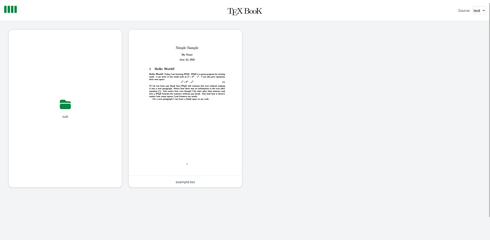

# TeXBooK

TexBooK is a web-based solution for managing LaTeX documents in a user-friendly fashion. I made it because I was tired of sifting through hundereds of uncompiled tex source files when looking for notes from a certain week in class, opening hundereds of files and still having to compile the file once I found it, praying that nothing is broken. TeXBooK allows you to add "data-sources" where your tex source files are and have them automatically compiled and hot reloaded, ready for instant usage on the web platform. All you have to do is find your file on the interface using the high-quality live renders, click on it, and download!



TeXBooK main page, example local data source selected

# Setup & Running TeXBooK

## Prerequisites
- **Node.js** (v18 or newer recommended)
- **Go** (v1.20 or newer recommended)

## 1. Clone the Repository
```
git clone https://github.com/torbenconto/TeXBooK.git
cd TeXBooK
```

## 2. Install Frontend Dependencies
```
cd TeXBooK
npm install
```

## 3. Build & Run the Frontend
```
npm run dev
```
This will start the Vite development server. By default, the app will be available at [http://localhost:5173](http://localhost:5173).

## 4. Build & Run the Backend
```
cd ../server/cmd/server
# Build the server
 go build -o TeXBooK-server
# Run the server
 ./TeXBooK-server
```
The backend will start and listen on its configured port, 8080 by default (see server config for details).

## 5. Access the Application
- Open your browser and go to [http://localhost:5173](http://localhost:5173) to use TeXBooK.

---

## Dev Notes
watcher is incompatible with any sort of cloud data source, needs to interop before any cloud data sources are avalible